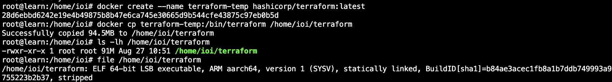
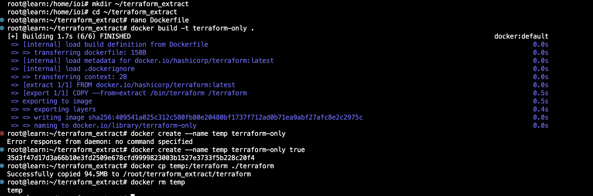

# home_work_2
1: Задание

2: Задание

3: Задание

4: Задание

4: Задание
https://github.com/Skryko/shvirtd-example-python

5: Задание

5: Задание

#!/bin/bash
set -e

ENV_FILE="/opt/app/.env"

if [ -f "$ENV_FILE" ]; then
    export $(grep -v '^#' "$ENV_FILE" | xargs)
else
    echo "Файл $ENV_FILE не найден!"
    exit 1
fi

BACKUP_DIR="/opt/backup"
mkdir -p "$BACKUP_DIR"

NOW=$(date +"%Y-%m-%d_%H%M%S")
BACKUP_FILE="${BACKUP_DIR}/backup-${NOW}.sql.gz"

docker exec -i app-db-1 mysqldump -u"$MYSQL_USER" -p"$MYSQL_PASSWORD" "$MYSQL_DATABASE" | gzip > "$BACKUP_FILE"

ls -lh "$BACKUP_FILE"

5: Задание

* * * * * /opt/backup/backup.sh >> /opt/backup/backup.log 2>&1

6: Задание

6: Задание

6.1: Задание

6.2: Задание

